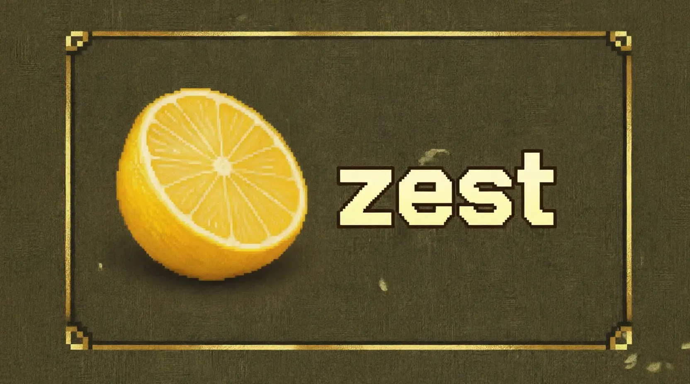

[-orange?logo=Zig&logoColor=Orange&label=Zig&labelColor=Orange)](https://ziglang.org/download/)
[](https://github.com/mmoehabb/zest/releases/tag/0.1.1)
[](https://github.com/mmoehabb/zest/blob/main/LICENSE)

## About

A relatively easy-to-pick, simple, and straightforward package that developers can use in order to write graphic applications in [Zig](https://ziglang.org/).

- [Install Zest](#install-zest)
- [Run an Example](#run-an-example)
- [Extend the Functionality](#extend-the-functionality)
- [Install SDL3](#install-sdl3)
- [TODOs](#todos)

## Install Zest

You can use Zest in your zig project by fetching it as follows:

```bash
zig fetch --save git+https://github.com/mmoehabb/zest.git
```

And then add it as an import in your exe root module:

```zig
const exe = b.addExecutable(.{
    .name = "your-project",
    .root_module = exe_mod,
});

const zest_dep = b.dependency("zest", .{
    .target = target,
    .optimize = optimize,
});

const zest_mod = zest_dep.module("zest");

exe.root_module.addImport("zest", zest_mod);
```

> Make sure to install SDL3 first.

## Run an Example

First ensure to install SDL3 on your machine, and Zig of course. Choose any example file in the examples directory, and then run it with the following command:

> Note: compatible only with zig versions ^0.16.0

  ```bash
  zig build example:<example-filename>
  ```

For instance:

  ```bash
  zig build example:moving-box
  ```
> You may also run examples via [luci](https://github.com/mmoehabb/luci). Which is a simple CLI tool that simplifies and unifies running CLI commands across different platforms.

## Extend the Functionality

I bet if you gave the code a look, you'd already know how to extend it and make a functional game with Zest. Here's the moving-box zig file:

```zig
const zest = @import("zest");
const std = @import("std");

pub fn main(init: std.process.Init) !void {
    const allocator = init.gpa;

    // Define and add plugins
    try zest.modules.PluginManager.init(allocator);
    defer zest.modules.PluginManager.deinit();

    var eventManager = zest.plugins.EventManager.init(allocator);
    defer eventManager.deinit();
    try zest.modules.PluginManager.add(&eventManager, "EventManager"); // Required by the Movement Script

    // Create a drawable object
    var rect = zest.drawables.Rect.new(
        .{ .w = 20, .h = 20, .d = 1 },
        .{ .g = 255 },
    );
    var rect_drawable = rect.toDrawable();

    var obj = zest.modules.Object.init(allocator, .{
        .name = "GreenBox",
        .position = .{ .x = 20, .y = 20, .z = 1 },
        .rotation = .{ .x = 0, .y = 0, .z = 0 },
        .drawable = &rect_drawable,
    });
    defer obj.deinit();

    // Add movement script to the object
    var movement = zest.scripts.Movement{ .velocity = 5, .smooth = true };
    try obj.addScript(@constCast(&movement.toScript()));

    // Create a scene and add the obj into it
    var scene = zest.modules.Scene.init(allocator);
    defer scene.deinit();
    try scene.addObject(&obj);

    // Create a screen, attach the scene to it, and open it
    var screen = try zest.modules.Screen.init(.{
        .title = "Simple Game",
        .width = 320,
        .height = 320,
        .rate = 1000 / 60,
    });
    defer screen.deinit();
    screen.setScene(&scene);
    try screen.open();
}
```

You may add as many objects as you want in the scene, you can easily add different functionalities and behaviour to your objects by adding scripts into them; you may use Zest pre-defined drawables and/or scripts or write your own ones as follows:

The Rect Drawable:

```zig
const zest = @import("zest");

pub const Rect = struct {
    dim: zest.types.common.Dimensions,
    color: zest.types.common.Color = .{},
    _draw_strategy: zest.modules.DrawStrategy = zest.modules.DrawStrategy{
        .draw = draw,
        .destroy = destroy,
    },

    pub fn new(dim: zest.types.common.Dimensions, color: zest.types.common.Color) Rect {
        return Rect{
            .dim = dim,
            .color = color,
        };
    }

    pub fn toDrawable(self: *Rect) zest.modules.Drawable {
        return zest.modules.Drawable{
            .dim = self.dim,
            .color = self.color,
            .drawStrategy = &self._draw_strategy,
        };
    }

    fn draw(
        _: *zest.modules.Drawable,
        _: *const zest.modules.DrawStrategy,
        renderer: *zest.sdl.SDL_Renderer,
        p: zest.types.common.Position,
        _: zest.types.common.Rotation,
        dim: zest.types.common.Dimensions,
    ) !void {
        if (!sdl.c.SDL_RenderFillRect(renderer, &sdl.c.SDL_FRect{
            .x = p.x,
            .y = p.y,
            .w = dim.w,
            .h = dim.h,
        })) return error.RenderFailed;
    }

    fn destroy(
        _: *zest.modules.Drawable,
        _: *const zest.modules.DrawStrategy,
    ) void {}
};
```

The Movement script:

```ZIG
const zest = @import("zest");

pub const Movement = struct {
    velocity: f32 = 5,
    smooth: bool = true,

    _script_strategy: zest.modules.ScriptStrategy = zest.modules.ScriptStrategy{
        .start = start,
        .update = update,
        .end = end,
    },

    _last_pressed: zest.types.event.Key = .Unknown,

    pub fn toScript(self: *Movement) zest.modules.Script {
        return modules.Script{ .strategy = &self._script_strategy };
    }

    fn start(_: *zest.modules.Script, _: *zest.modules.Object) void {}

    fn update(s: *zest.modules.Script, o: *zest.modules.Object) void {
        const obj = o;
        const self = @as(*Movement, @constCast(@fieldParentPtr("_script_strategy", s.strategy)));
        var em = o.*._scene.?.screen.?.em;

        if (self.smooth) {
            if (em.isKeyDown(.W)) obj.position.y -= self.velocity;
            if (em.isKeyDown(.S)) obj.position.y += self.velocity;
            if (em.isKeyDown(.D)) obj.position.x += self.velocity;
            if (em.isKeyDown(.A)) obj.position.x -= self.velocity;
            return;
        }

      // ...
    }

    fn end(_: *zest.modules.Script, _: *zest.modules.Object) void {}
};
```

Moreover, you may access SDL indirectly from Zest, and use SDL facilities in your scripts:

```zig
const sdl = @import("zest").sdl;
sdl.SDL_RenderFillRect(...);
```

## Install SDL3

This guide provides brief instructions for installing SDL3 on various operating systems.

> Generated by Grok; with further, manual, modifications.

### Windows

- **Using vcpkg**:

  ```bash
  vcpkg install sdl3
  vcpkg install sdl3_ttf
  vcpkg install sdl3_image
  ```

- **Manual Installation**:

  - Download the SDL3 development libraries from [libsdl.org](https://www.libsdl.org).
  - Extract the archive and add the `include` and `lib` directories to your compiler's include and library paths.
  - Ensure `SDL3.dll` is in your executable's directory or system PATH.

### macOS

- **Using Homebrew**:

  ```bash
  brew install sdl3
  brew install sdl3_ttf
  brew install sdl3_image
  ```

- **Manual Installation**:

  - Download the SDL3 DMG from [libsdl.org](https://www.libsdl.org).
  - Copy `SDL3.framework` to `/Library/Frameworks` or your project directory.
  - Link against the framework in your build configuration.

### Linux (Ubuntu/Debian)

- **Using apt**:

  ```bash
  sudo apt-get update
  sudo apt-get install libsdl3-dev
  sudo apt-get install libsdl3_ttf-dev
  sudo apt-get install libsdl3_image-dev
  ```

- **Manual Installation**:

  1. Install SDL3
    ```bash
    wget https://github.com/libsdl-org/SDL/releases/download/release-3.2.26/SDL3-3.2.26.tar.gz
    tar -xf SDL3-3.2.26.tar.gz
    mkdir ./SDL3-3.2.26/build
    cd ./SDL3-3.2.26/build
    cmake ..
    cmake --build . --parallel $(nproc)
    sudo cmake --install .
  ```

  2. Install SDL3_ttf
    ```bash
    wget https://github.com/libsdl-org/SDL_ttf/releases/download/release-3.2.2/SDL3_ttf-3.2.2.tar.gz
    tar -xf SDL3_ttf-3.2.2.tar.gz
    mkdir ./SDL3_ttf-3.2.2/build
    cd ./SDL3_ttf-3.2.2/build
    cmake ..
    cmake --build . --parallel $(nproc)
    sudo cmake --install .
  ```

  3. Install SDL3_image
    ```bash
    wget https://github.com/libsdl-org/SDL_image/releases/download/release-3.2.4/SDL3_image-3.2.4.tar.gz
    tar -xf SDL3_image-3.2.4.tar.gz
    mkdir ./SDL3_image-3.2.4/build
    cd ./SDL3_image-3.2.4/build
    cmake ..
    cmake --build . --parallel $(nproc)
    sudo cmake --install .
  ```

### Linux (Fedora)

- **Using dnf**:

  ```bash
  sudo dnf install SDL3-devel
  sudo dnf install SDL3_ttf-devel
  sudo dnf install SDL3_image-devel
  ```

### Linux (Arch)

- **Using paru**:

  ```bash
  paru -S sdl3
  paru -S sdl3_ttf
  paru -S sdl3_image
  ```

### Verifying Installation

- Run `pkg-config --libs --cflags sdl3` to check if SDL3 is correctly installed and accessible.
- Ensure your build system (e.g., Zig) can find SDL3 by linking with `-lSDL3`.

For detailed instructions or troubleshooting, visit the [SDL3 documentation](https://wiki.libsdl.org/SDL3/Installation).


## TODOs

### Version 0.2.0

#### Features
- [x] Add loop, pause and volume settings in the AudioPlayer.
- [x] Make scenes behave like cameras; they can zoom in and out, and move in the four directions.

#### Drawables
- [x] Implement a drawable for each common geometric shape.
- [x] Implement interactive UI drawables: Button, TextInput, Select, and Checkbox.
- [x] Implement SVG Drawable.

#### Refactor
- [x] Improve _getObjectByName_ & _getObjectsByTag_ methods in the _scene_ module, by adding memoization. \
NOTE: the memo should be invalidated as well when child objects are added to scene objects.

#### Scripts
- [x] Implement _Rigidbody_ script; it should, at minimum, specify the mass of the object, detect collisions, and apply gravity.
- [x] Implement _Collision_ script; any two objects with this script, and one of them is a rigid-body, they shall not overlap.
- [ ] Implement AudioSource and AudioListener scripts. The general idea is that whenever an AudioSource \
commence to play an audio, it searches for an AudioListener in the same scene. Once it find one, it plays \
the audio with the volumes of its channels twisted according to the distance between the two objects (one \
carries the source, and another carries the listener).
- [ ] Write Animation and Animator scripts.

#### Examples
- [x] Write SVG Example.
- [x] Write UI Example.
- [ ] Develop a [Pong game](https://www.ponggame.org/).
- [ ] Develop a Sokoban game.
